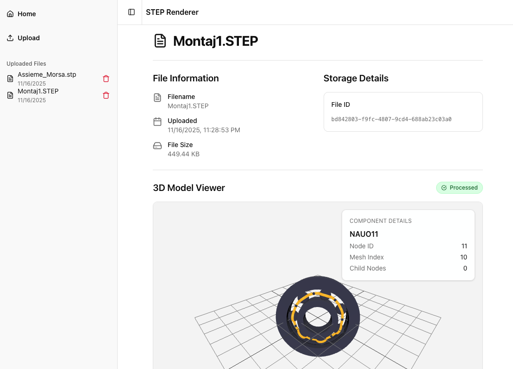

# Step Render

### Start PostgreSQL and MinIO:

```bash
docker-compose up -d
```

Verify services are running

```bash
docker ps
```

### Setup fastAPI

Create and activate virtual environment

```bash
cd api
python3 -m venv venv
source venv/bin/activate
pip install -r requirements.txt
```

### Run API
```bash
chmod +x runLocalAPI.sh  # may need this
./runLocalAPI.sh
```

API docs: `http://localhost:8000/docs`

### Run Next 
```bash
cd web/my-app
npm install
```

```bash
cd web/my-app
npm run dev
```

### Example STEP Files Available

